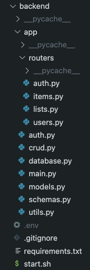

# Deploy a Full Stack App to Render and Vercel

This document provides a step-by-step guide for deploying a full-stack application with a backend and database to Render.

## Project Structure



## Backend Deployment on Render

### Step 1: Deploy the Backend

1. **Create a Web Service**
   - Go to your Render dashboard.
   - Click on `+ New` and select `Web Service`.
   - Choose the Github repository that contains your application.
   - Click `Connect`.

2. **Configure the Web Service**
   - **Name**: Provide a unique name for your app.
   - **Project**: Add it to an existing project or leave it blank if it's standalone.
   - **Language**: Python 3.11.
   - **Branch**: `main` (or your chosen branch).
   - **Region**: Leave the default selection or choose a preferred region.

3. **Set Up the Build and Start Commands**
   - **Root Directory**: Set this to `backend/`.
     > **Note**: Once the root directory is selected, it will apply to the build command and start command automatically.
   - **Build Command**: `pip install -r requirements.txt`
   - **Start Command**: `bash start.sh`

4. **Select Instance Type**
   - Choose `free` or a paid plan based on your requirements.

5. **Environment Variables**
   - Set up the following environment variables:
     - `DATABASE_URL`: (Add the value after creating a database—use the Internal Database URL to link the backend and database within Render)
     - `SECRET_KEY`: (A secret key used for logging in to the app, ensure this is securely generated and stored)

6. Click `Create Web Service` to deploy.

### Step 2: Set Up the Database

1. **Create a PostgreSQL Database**
   - On the Render dashboard, click on `+ New` and select `PostgreSQL`.
   - Provide a **unique name** for your database.
   - Link the database to the project above (optional).

2. **Database Settings**
   - You can leave the database name and user options as default or customize them if needed.
   - **PostgreSQL Version**: Leave as the preselected value (e.g., 16).
   - **Instance Type**: Select `free` or a paid plan.

3. Click `Create Database` to finalize.

## Notes

- Make sure to use the Internal Database URL provided by Render for your `DATABASE_URL` environment variable, as this ensures your backend and database are properly linked within Render.
- If you update the backend code, re-deploy the web service to apply changes.
- For security, ensure sensitive environment variables (e.g., `SECRET_KEY`) are not hardcoded and are instead securely managed in Render's environment settings.

## Additional Resources

- [Render Documentation](https://render.com/docs) for further details on deployment configurations and troubleshooting.
- Make sure your `requirements.txt` file contains all necessary dependencies for the backend.
- Verify your `start.sh` script properly initializes and starts your application.

## Example `start.sh` Script

```bash
#!/bin/bash
uvicorn app.main:app --host 0.0.0.0 --port $PORT
```

## Frontend Deployment on Vercel

### Step 1: Create a New Project

1. Go to the [Vercel dashboard](https://vercel.com/dashboard).
2. Click on **Add New Project**.
3. Select **Import Git Repository** and choose the GitHub repository containing your frontend code.
4. Click **Continue**.

### Step 2: Configure Project Settings

1. **Root Directory**: Set the root directory to `frontend/testapp` (or wherever your frontend code is located).
2. **Framework Preset**: If using a framework like React or Vue, Vercel will automatically detect and apply the correct settings. Confirm these when prompted.
3. **Build and Output Settings**:
   - **Build Command**: This should be automatically detected based on the framework. If not, provide the appropriate command (e.g., `npm run build` or `yarn build`).
   - **Output Directory**: Set this to `dist` or `build` (depending on your framework’s output directory).

### Step 3: Set Environment Variables

1. Go to the **Environment Variables** section.
2. Add the following environment variable:
   - `VITE_API_BASE_URL`: This should point to your backend’s API URL (e.g., `https://your-backend-app.onrender.com`). This allows your frontend to communicate with the backend.

### Step 4: Deploy the Frontend

1. Click **Deploy** to start the deployment process. Vercel will build and deploy your application.
2. Once deployed, you will receive a live URL for your frontend application.

### Notes

- Ensure that `VITE_API_BASE_URL` matches the URL of your backend service deployed on Render. You may need to update this environment variable if the backend URL changes.
- If you encounter issues with the build, check the **build log** for errors and verify that all dependencies are correctly listed in your `package.json`.
- Redeploy the frontend on Vercel whenever there are significant changes in your codebase.

### Additional Resources

- [Vercel Documentation](https://vercel.com/docs) for more details on deployment configurations and troubleshooting.
- Make sure your `.env` file (if any) is not pushed to the repository to keep sensitive information secure.
